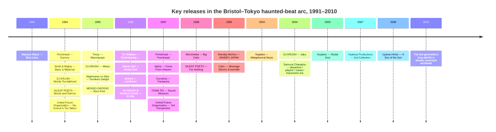

# After the Ecstasy: Bristol, Tokyo, and the Haunted Beat

## Executive summary

The most illuminating way to organise a narrative about trip-hop is not to treat it as a stable genre first and a historical scene second, but to flip that order. The sound coheres if you hear it as a *social function*: music for the after-hours, the walk home, the cigarette on the curb, the comedown after the rave’s collective acceleration. The term itself emerged in 1994 around Mo’ Wax, DJ Shadow, and London after-hours circulation, while the style’s deepest roots lay in Bristol’s slower, bass-heavy, dub-inflected sound-system culture and its post-punk bohemia. Even then, many of the artists most associated with the label distrusted or outright disliked it.

Bristol matters here less as a single city with a single sound than as a weather system: a port city whose Black British sound-system culture, reggae and dub inheritance, hip-hop uptake, and post-punk melancholy made *Blue Lines*, *Dummy*, and *Maxinquaye* possible. The Wild Bunch’s genre promiscuity—hip-hop, reggae, punk, soul, ambient drift—was not a side detail; it was the method. That is why Bristol produced a “scene” that was always already more than one sound.

Tokyo matters because it did not merely imitate this weather. It translated and transformed it. Japanese hip-hop culture had already been catalysed by the early circulation of *Wild Style* and by local club and record-shop infrastructures; DJ Krush turned turntablism into an austere, spatial, almost calligraphic art, while Shibuya-kei and club-jazz scenes in Tokyo created a parallel cosmopolitan ecology of quotation, sophistication, and groove. By the time Hydeout Productions and *Samurai Champloo* arrived, Tokyo had become one of the key sites where trip-hop’s darker noir vocabulary was softened, thinned into air, and reissued globally as something warmer, more melodic, and more intimate.

A final methodological note: some of the records below are “pure” trip-hop only if one uses the term very loosely. That looseness is part of the argument. The scene’s most fertile records often live at the borders—abstract hip-hop, downtempo, club-jazz, acid jazz, Shibuya-kei, sampledelia, soundtrack work—because trip-hop was always more a sensibility of tempo, density, bass pressure, and haunted sampling than a cleanly bounded style.

Useful primary or near-primary reference links for key claims include [Massive Attack’s official site](https://www.massiveattack.co.uk/), [Portishead’s official site](https://www.portishead.co.uk/), [Tricky’s official page for *Nearly God*](https://www.trickysite.com/nearly-god/), [DJ KRUSH’s official discography](https://djkrush.jp/en/disco/), [Victor/FlyingDog’s official page for *samurai champloo music record "departure"*](https://www.jvcmusic.co.jp/-/Discography/A018999/VTJL-7.html), [SILENT POETS’ official discography](https://www.silentpoets.net/discography/words-and-silence/), [Roland’s label spotlight on Mo’ Wax and UNKLE](https://articles.roland.com/label-spotlight-mo-wax-records-and-unkle/), and the Hydeout-related official press material archived via [PR TIMES](https://prtimes.jp/main/html/rd/p/000000640.000011969.html).

Illustrative cover and image links: [*Blue Lines* cover page on Apple Music 100](https://100best.music.apple.com/us/album/87), [Ben Drury’s *Meiso* cover in MoMA’s collection](https://www.moma.org/collection/works/189267), and [the official *samurai champloo music record "departure"* release page with jacket image](https://www.jvcmusic.co.jp/-/Discography/A018999/VTJL-7.html).

## Night after the night

The “comedown thesis” is best understood as an inference from the documented social life of the music. Trip-hop was attached early to after-hours listening and club circulation, but it refused club music’s imperative to peak. It took the architecture of hip-hop—breaks, loops, samples, bass, suspended repetition—and drained it of triumphal certainty. Instead it offered narcotic drift, dread, erotic fatigue, and the strange lucidity that follows overstimulation. That helps explain why so many canonical records feel less like party records than like records that *remember* the party from the next room over.

This is also why the best entry points are not necessarily the “most representative” records in a taxonomic sense. They are the ones that most persuasively stage the transition from kinetic rave modernity to slower, more reflective, haunted listening: from the floor to the sofa, from collective ecstasy to private fallout.

| Artist            | Album                 | Year | Listening note                                                                                                                                                                                                                          |
| ----------------- | --------------------- | ---: | --------------------------------------------------------------------------------------------------------------------------------------------------------------------------------------------------------------------------------------- |
| Massive Attack    | *Blue Lines*          | 1991 | The ur-text: hip-hop cadence, dub depth, soul lament, and sound-system patience fused into an album that feels physically slow without ever becoming inert. Start here if you want the “before the term existed” version of the thesis. |
| Portishead        | *Dummy*               | 1994 | Noir without kitsch: turntable abrasion, spy-soundtrack melodrama, and Beth Gibbons’ voice as a form of wounded interiorscape. It sounds like insomnia staged as design.                                                                |
| Tricky            | *Maxinquaye*          | 1995 | The genre’s most destabilising masterpiece—half-whispered, paranoid, intimate, anti-spectacular. If *Blue Lines* is the city at dusk, this is the city after midnight, when every corner feels psychically charged.                     |
| Nightmares on Wax | *Smokers Delight*     | 1995 | Less gothic than Bristol, more horizontally blissed-out, but crucial for hearing the comedown as groove rather than crisis. The beats recline instead of lurch.                                                                         |
| Lamb              | *Lamb*                | 1996 | A Manchester variant where trip-hop rubs against drum-and-bass fracture and torch-song intensity. Lou Rhodes gives the style a rare, almost devotional ache.                                                                            |
| Bowery Electric   | *Beat*                | 1996 | A New York answer from the shoegaze edge: less urban-noir cinema, more narcotic fog and negative space. Essential if you want to hear how trip-hop bled into dream-pop and post-rock atmospherics.                                      |
| Archive           | *Londinium*           | 1996 | Colder and more architectural than many Bristol records, with rap, melancholy, and metropolitan scale. An excellent bridge between trip-hop and later European downtempo.                                                               |
| Sneaker Pimps     | *Becoming X*          | 1996 | Pop-minded but never trivial: sleek hooks, covert menace, and a sense of late-’90s stylish alienation. A good reminder that trip-hop’s commercial edge did not always flatten its mood.                                                 |
| Morcheeba         | *Big Calm*            | 1998 | Warmer, sunnier, and more organic than the Bristol core, but still unmistakably post-club in its loosened pulse and low-lit spaciousness. Ideal for hearing the style turn from dread toward ease.                                      |
| Esthero           | *Breath from Another* | 1998 | A beautifully overdressed detour: lounge, acid jazz, trip-hop, and sly theatricality. It proves the genre could be glamorous without losing its undertow.                                                                               |

## Bristol weather

Bristol’s centrality is not just a matter of chronology. It is a matter of atmosphere and infrastructure. Britannica, the British Council, and scholarship on the so-called “Bristol sound” all emphasise the same cluster of conditions: a port city, racial and musical plurality, Jamaican sound-system influence, post-punk residue, and a scene in which DJs and producers treated genre as material rather than allegiance. The Wild Bunch’s significance lies precisely in that promiscuous method of assembly.

That is why Bristol should be pictured less as an origin point and more as a pressure system that kept generating variants. Even within a narrow temporal window, Massive Attack, Portishead, Tricky, Smith & Mighty, and Alpha do not sound interchangeable. What they share is not a single template but a shared climate: heavy low end, slowed hip-hop logic, dub spaciousness, and an insistence that melancholy can be produced, arranged, and engineered with as much care as euphoria.

| Artist                   | Album                                  | Year | Listening note                                                                                                                                                                                                                        |
| ------------------------ | -------------------------------------- | ---: | ------------------------------------------------------------------------------------------------------------------------------------------------------------------------------------------------------------------------------------- |
| Smith & Mighty           | *Bass Is Maternal*                     | 1995 | The deep prehistory made audible: dub bass, Bristol break science, and a clear sense that the city’s contribution began below the canonical “big three.” If you need a foundation text for Bristol before canon ossified, this is it. |
| Massive Attack           | *Protection*                           | 1994 | More liquid and nocturnal than *Blue Lines*, with a richer sense of dub as emotional architecture. It is the record where the Bristol atmosphere becomes almost tactile.                                                              |
| Portishead               | *Portishead*                           | 1997 | Harsher and more self-manufactured than *Dummy*: less reliant on external samples, more obsessed with creating its own internal decay. Hear it as self-conscious artifice turned uncanny.                                             |
| Nearly God               | *Nearly God*                           | 1996 | Tricky under an alias, but really Tricky as curator of psychic weather: unfinished demos, guest voices, and a strange stasis that feels more private than theatrical.                                                                 |
| Tricky                   | *Pre-Millennium Tension*               | 1996 | More difficult and claustrophobic than *Maxinquaye*, but rewarding precisely because it resists ambient prettiness. The comedown here becomes fever rather than drift.                                                                |
| Alpha                    | *Come From Heaven*                     | 1997 | Released on Massive Attack’s Melankolic imprint, it is one of the great “second-ring” Bristol records: softer focus, narcotic romance, and rain-streaked melancholy at every turn.                                                    |
| Smoke City               | *Flying Away*                          | 1997 | Brazilian textures and metropolitan trip-hop restraint combine into something sensuous and unusually buoyant. It widens the palette without losing the late-night aura.                                                               |
| Hooverphonic             | *A New Stereophonic Sound Spectacular* | 1996 | Belgian rather than Bristolian, but a crucial proof of diffusion: the style travels into ambient pop and widescreen mood design without losing its low-lit pulse.                                                                     |
| Mono                     | *Formica Blues*                        | 1997 | Glossy, urban, and curiously weightless, with “Life in Mono” as one of the style’s purest expressions of glamorous sadness. A useful counterexample to the assumption that trip-hop must feel grimy.                                  |
| The Third Eye Foundation | *Ghost*                                | 1997 | Not “trip-hop” in any orthodox sense, but vital if you want the Bristol weather pushed into harsher, more abstract territory. An edge case that clarifies the scene’s sonic perimeter.                                                |

## The sampler as ghost machine

If Bristol explains the weather, labels explain the circulation. The term “trip-hop” first attached itself in print to DJ Shadow and Mo’ Wax, and that matters because Mo’ Wax and, in a parallel but distinct way, Ninja Tune turned local mood into a transnational network of records, sleeves, shops, and affinities. Mo’ Wax’s importance was not simply that it released records; it provided a graphic and conceptual frame joining turntablism, abstract hip-hop, downtempo drift, and art-school design. Ninja Tune, founded by Coldcut in 1990, did something similar with a broader roster and a more overtly experimental remit.

This is where the sampler starts to behave like a ghost machine. Its function is not merely quotation; it makes memory audible, turns debris into atmosphere, and makes geographically distant scenes feel uncannily proximate. DJ Shadow in California, DJ Krush in Tokyo, UNKLE in London, DJ Food and The Herbaliser in the Ninja Tune orbit, and later Thievery Corporation in Washington all share this logic: the beat as archive, the loop as séance, the mix as architecture of recall.

| Artist               | Album                                    | Year | Listening note                                                                                                                                                                     |
| -------------------- | ---------------------------------------- | ---: | ---------------------------------------------------------------------------------------------------------------------------------------------------------------------------------- |
| DJ Shadow            | *Endtroducing…..*                        | 1996 | The definitive sampler-as-consciousness record: shadowy, allusive, and built almost entirely from vinyl fragments. It is less a set of songs than a theory of memory in beat form. |
| DJ Food              | *A Recipe For Disaster*                  | 1995 | A Ninja Tune cornerstone that hears the kitchen, the studio, and the collage suite as one space. Fantastic for tracing how trip-hop’s methods overlap with cut-up comic absurdity. |
| The Herbaliser       | *Remedies*                               | 1995 | More hip-hop-forward, jazzier, and more playful than the Bristol core, but deeply relevant for understanding the Ninja Tune branch of downbeat culture.                            |
| DJ Cam               | *Underground Vibes*                      | 1995 | A French answer to Mo’ Wax minimalism: smoked jazz loops, cool surfaces, elegant groove control. A sleeper classic if you want trip-hop without gothic melodrama.                  |
| UNKLE                | *Psyence Fiction*                        | 1998 | Mo’ Wax grown cinematic and maximal: guest-heavy, brittle, and ambitious. Hear it as the moment the scene’s underground grammar began speaking blockbuster scale.                  |
| Kid Loco             | *A Grand Love Story*                     | 1997 | Velvet, kitsch, and blissed-out romanticism. It shows how the trip-hop toolkit could be used for hedonism and charm rather than dread.                                             |
| Thievery Corporation | *Sounds From The Thievery Hi-Fi*         | 1997 | One of the clearest early signs that the style had become globally portable: dub, electronica, lounge, and cosmopolitan crate-digging fused into a highly exportable nocturne.     |
| Kruder & Dorfmeister | *The K&D Sessions*                       | 1998 | Remixes as atmosphere engineering. Not a studio album in the strict sense, but indispensable for hearing how downtempo became a continental design language.                       |
| Tosca                | *Suzuki*                                 | 2000 | Vienna’s dub-techno elegance brought down to sofa tempo. If you want the cigarette-smoke side of early-2000s downtempo, this is the record.                                        |
| Lovage               | *Music to Make Love to Your Old Lady By* | 2001 | A knowingly decadent late mutation: lounge parody, seduction pastiche, and genuine downbeat craft all at once. It works best when heard as the genre becoming self-aware.          |

## Tokyo receives and transforms the beat

Tokyo’s role in this history is not secondary or merely “influenced by.” It is co-constitutive. Japanese hip-hop took shape in dialogue with imported films, records, and styles in the early 1980s, and one of the most repeated origin stories is DJ Krush seeing *Wild Style* and deciding, effectively, to step into the culture. From there, Tokyo developed multiple overlapping routes into haunted-beat music: turntablism and abstract hip-hop; Shibuya-kei’s exquisitely curated pop cosmopolitanism; club-jazz and acid-jazz hybrids; and, later, Hydeout’s intimate, jazz-rap-inflected afterlife of trip-hop.

What changed in Tokyo was affect. Bristol often sounds rain-dark, nicotine-stained, burdened by post-punk gravity. Tokyo frequently thins the same materials into cleaner contours: more air between elements, more attention to texture as texture, a stronger tolerance for elegance, and eventually a shift from noir anxiety toward reflective warmth. *Samurai Champloo* then globalised that transformation by embedding underground hip-hop production into one of the 2000s’ most influential anime sound worlds, carried officially through four soundtrack albums and repeatedly reissued.

| Artist                           | Album                                       | Year | Listening note                                                                                                                                                                                             |
| -------------------------------- | ------------------------------------------- | ---: | ---------------------------------------------------------------------------------------------------------------------------------------------------------------------------------------------------------- |
| DJ KRUSH                         | *Strictly Turntablized*                     | 1994 | The Tokyo-London hinge: austere, beat-led, and spatially disciplined. It is one of the cleanest demonstrations of how Japanese minimalism sharpened Mo’ Wax-era downbeat logic.                            |
| DJ KRUSH                         | *Meiso*                                     | 1995 | Krush’s breakthrough statement of meditative force—less “trip-hop” as genre badge than beat architecture as urban calligraphy. The guest features never disturb its poise.                                 |
| DJ KRUSH & Toshinori Kondo       | *Ki-Oku*                                    | 1996 | A serene, uncanny fusion of trumpet jazz and beat science. Essential for hearing Tokyo make abstract hip-hop feel ceremonial rather than merely smoked-out.                                                |
| DJ KRUSH                         | *Jaku*                                      | 2004 | By the 2000s Krush was folding more explicitly Japanese instrumental colour into his sound. The result is grander and darker, but still disciplined by emptiness.                                          |
| SILENT POETS                     | *Words and Silence*                         | 1994 | One of the strongest Japanese counterparts to early trip-hop proper: dubwise bass, spoken-word lineage, and a spacious, contemplative pulse.                                                               |
| SILENT POETS                     | *For Nothing*                               | 1998 | A later refinement of the project’s moody, dub-inflected poetics. Slightly glossier, but still fundamentally nocturnal and suspended.                                                                      |
| United Future Organization       | *No Sound Is Too Taboo*                     | 1994 | Not orthodox trip-hop, but indispensable for Tokyo’s club-jazz wing: stylish, cosmopolitan, and built from deep crate knowledge. It shows how the city translated downbeat sensibility into urbane motion. |
| United Future Organization       | *3rd Perspective*                           | 1997 | Sleeker and more internationally poised than the earlier work. A perfect example of Tokyo’s 1990s ability to make sophistication itself into a groove.                                                     |
| MONDO GROSSO                     | *Born Free*                                 | 1995 | Acid jazz, house, Brazilian influence, and downtempo intelligence converging in one of the era’s key Tokyo club albums. Think of it as part of the same citywide ecosystem, not a genre outlier.           |
| TOWA TEI                         | *Sound Museum*                              | 1997 | A Shibuya-kei/pop-art route into the same cosmopolitan, sample-savvy universe. More playful than haunted, but deeply relevant to Tokyo’s aesthetics of quotation and polish.                               |
| Cornelius                        | *Fantasma*                                  | 1997 | Again, not strict trip-hop, but crucial context: a dazzling collage album from Tokyo’s quotation culture, making eclectic sampling feel architectural and intimate all at once.                            |
| Monday Michiru                   | *MAIDEN JAPAN*                              | 1999 | Soulful, jazzy, and city-pop adjacent, with enough downtempo poise to belong in this wider Tokyo constellation. A fine route for listeners who want less noir and more midnight elegance.                  |
| Calm                             | *Moonage Electric Ensemble*                 | 1999 | Dreamier and more open-hearted than the Krush line, but beautifully demonstrates Tokyo’s capacity to make downtempo feel expansive rather than enclosed.                                                   |
| Nujabes                          | *Metaphorical Music*                        | 2003 | Hydeout’s first full revelation: jazz-rap, downtempo, cracked-beat tenderness, and a new emotional directness. This is where trip-hop’s haunted beat begins turning toward memory as solace.               |
| Nujabes                          | *Modal Soul*                                | 2005 | The most beloved Hydeout full-length for good reason: lyrical soul, immaculate sequencing, and a near-perfect balance between beat craft and emotional release.                                            |
| Nujabes, Fat Jon, Shing02, MINMI | *samurai champloo music record "departure"* | 2004 | A crucial globalising vector. The soundtrack’s hip-hop/Edo-period hybrid turned Tokyo’s underground beat aesthetics into a worldwide point of entry for a generation of listeners.                         |
| Uyama Hiroto                     | *A Son of the Sun*                          | 2008 | Hydeout after Nujabes, but not merely derivative: more live instrumentation, more jazz horizon, and a sense of continuity without imitation. One of the essential “after trip-hop” records from Japan.     |

## Tokyo after midnight

For a cousin in Japan and his Japanese girlfriend, the most hospitable listening route is not “the best albums in order,” but a sequence that moves from the immediately inviting to the more severe, while staying inside Japanese scenes as much as possible. That route also shows how broad Tokyo’s contribution really was: anime gateway, abstract beat craft, club-jazz sophistication, Shibuya quotation, and Hydeout intimacy all belong to one story.

| Route                      | Start here                                           | Then go to                                          | Why this works                                                                                                                                                                                             |
| -------------------------- | ---------------------------------------------------- | --------------------------------------------------- | ---------------------------------------------------------------------------------------------------------------------------------------------------------------------------------------------------------- |
| Soft entry                 | Nujabes — *Modal Soul*                               | Uyama Hiroto — *A Son of the Sun*                   | Warm, melodic, emotionally legible, and beautifully produced; the easiest on-ramp if they already like chill, jazzy, beat-driven music.                                                                    |
| Anime gateway              | *samurai champloo music record "departure"*          | TSUTCHIE — *samurai champloo music record playlist* | If they know the series, this instantly makes the style feel lived-in rather than historical. It also maps the breadth of the soundtrack ecosystem around Nujabes, Fat Jon, Tsutchie, and others.          |
| The severe route           | DJ KRUSH — *Meiso*                                   | DJ KRUSH — *Ki-Oku*                                 | For listeners who like spaciousness, silence, and a more meditative, urban heaviness. Krush is the most direct path to Tokyo’s austere contribution.                                                       |
| Dub-poetic route           | SILENT POETS — *Words and Silence*                   | SILENT POETS — *For Nothing*                        | Best for people who want the bass pressure, dub atmosphere, and spoken-word lineage without losing subtlety.                                                                                               |
| Tokyo club-jazz route      | United Future Organization — *No Sound Is Too Taboo* | MONDO GROSSO — *Born Free*                          | These records are less haunted than Bristol, but they show how Tokyo’s 1990s sophistication made the downbeat world feel urbane, mobile, and worldly.                                                      |
| Shibuya cosmopolitan route | TOWA TEI — *Sound Museum*                            | Cornelius — *Fantasma*                              | For listeners who like curatorial intelligence, quotation, pop-art surface, and stylish eclecticism. This is the Tokyo route that explains why the city mattered aesthetically, not just beat-technically. |
| Elegant soul route         | Monday Michiru — *MAIDEN JAPAN*                      | Calm — *Moonage Electric Ensemble*                  | A less obvious but very persuasive pair for listeners who want midnight sophistication rather than noir.                                                                                                   |

If you want a single seven-evening Japanese sequence, I would program it this way: *Modal Soul*; *departure*; *Meiso*; *Words and Silence*; *No Sound Is Too Taboo*; *Fantasma*; *A Son of the Sun*. That path moves from immediately lovable to historically deeper, without losing coherence of mood.

## Timeline and closing synthesis

The releases below track the argument’s main arc: Bristol’s early weather system, Mo’ Wax and Ninja Tune’s transnational circulation, and Tokyo’s transformation of the haunted beat into new forms between 1991 and 2010.

Bristol gave trip-hop its pressure, pace, and weather; Tokyo gave it a second life by cleaning its lines, widening its emotional register, and sending it back into the world through club culture, design culture, label culture, and anime culture. If Bristol made the haunted beat sound like the city after ecstasy, Tokyo taught it how to endure the morning after—clearer, lonelier, and, sometimes, unexpectedly consoling.
